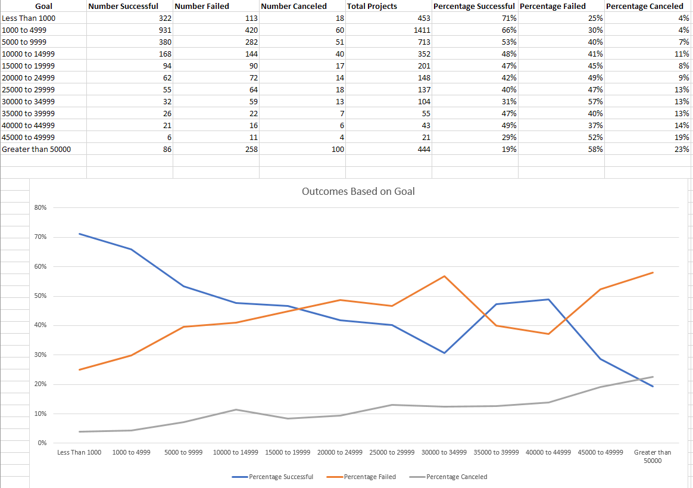

## Background
Over two billion dollars have been raised using the massively successful crowdfunding service, Kickstarter, but not every project has found success. Of the over 300,000 projects launched on Kickstarter, only a third have made it through the funding process with a positive outcome.

Since getting funded on Kickstarter requires meeting or exceeding the project's initial goal, many organizations spend months looking through past projects in an attempt to discover some trick to finding success. This project is to organize and analyze a database of four thousand past projects in order to uncover any hidden trends.

**Find Report of the analysis [here](https://github.com/prajakta-gaikwad/Kickstarter/blob/master/Kickstarter_analysis.docx)**

## Dataset:
* Using below Excel table, the data of four thousand past Kickstarter projects has been modified and analyzed to uncover some of the market trends.

